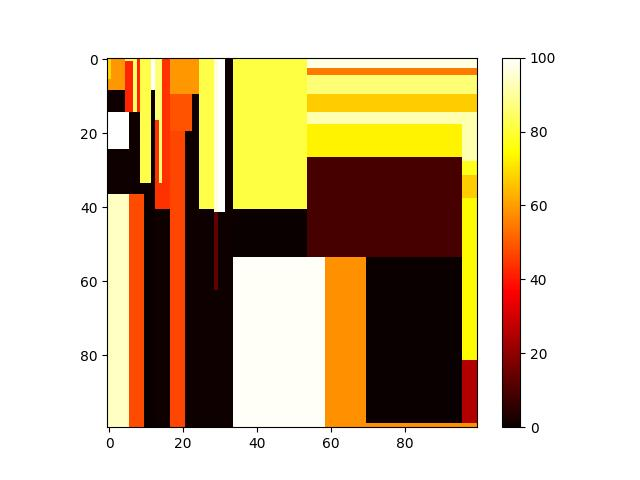

# ML-proj-BPP
SJTU CS3308 Machine Learning final project, created by [[Junxuan Liang]](https://github.com/hitefork), [[Jiang Nan]](https://github.com/Chiang-17), [[Yue Yuan]](https://github.com/12y1y38).


# Installation
```bash
git clone https://github.com/hitefork/ML-proj-BPP.git
conda create -n binpacking python=3.8
conda activate binpacking
cd ML-proj-BPP
pip install -r requirements.txt
```

# Checkpoints

Our trained model checkpoints can be found in [Link](https://jbox.sjtu.edu.cn/l/j1iBwp)


# Task1

```bash
python task1.py --load_path="your path to task1.pt"
```

After running the instruction, you could check */Box_data/task1.jpg* to see the visualization



# Task2

```bash
python task2.py --load_path="your path to task2.pt"
```
After running the instruction, you could check */Box_data/task2.jpg* to see the visualization


# Task3

## Without REINFORCE training
```bash
python task3.py --load_path="your path to task3.pt"
```
## With REINFORCE training
```bash
python task3.py --load_path="your path to task3_online.pt"
```

After running the instruction, you could check */Box_data/task3_xx\*xx\*xx.jpg* to see the visualization

## Maskable PPO

See *demo_sb3_train_ipynb* and *demo_packing_env.ipynb*. The name of model weights is "ppo_mask_interm_10000.zip",you could check */gifs/strain_5_boxes.gif* to see the visualization


